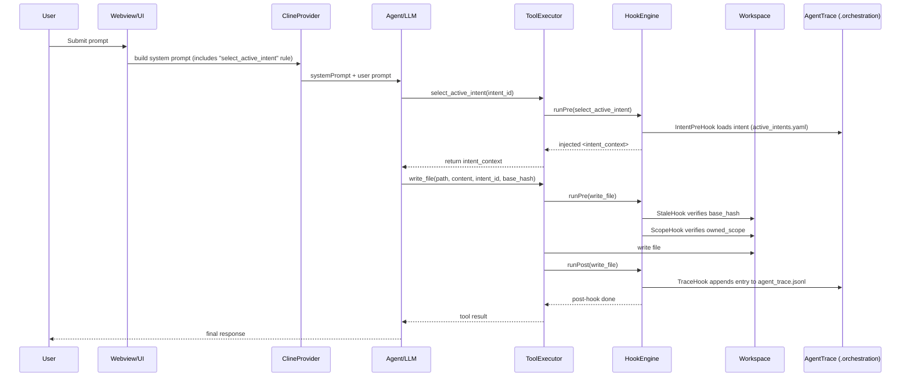

# TRP1 Roo Code Governed IDE Architecture

## Overview

This extension upgrades Roo Code into an Intent-Driven AI-Native IDE by injecting a deterministic Hook Middleware between the agent and tool execution.

## Core Innovation

Intent → AST → Trace linkage via sidecar orchestration database.

## Execution Flow

User → Agent → select_active_intent → Hook injects context → write_file → Hook logs trace.

## Hook Engine

Central interceptor wrapping all tools.

Pre-Hooks:

- Intent selection validation
- Scope enforcement
- Optimistic locking

Post-Hooks:

- Content hashing
- Agent trace logging

## Sidecar Storage

.orchestration/

# TRP1 Roo Code Governed IDE Architecture

## Overview

This extension upgrades Roo Code into an Intent-Driven AI-Native IDE by injecting a deterministic Hook Middleware between the agent and tool execution.

## Core Innovation

Intent → AST → Trace linkage via sidecar orchestration database.

## Execution Flow

User → Agent → select_active_intent → Hook injects context → write_file → Hook logs trace.

## Hook Engine

Central interceptor wrapping all tools.

Pre-Hooks:

- Intent selection validation
- Scope enforcement
- Optimistic locking

Post-Hooks:

- Content hashing
- Agent trace logging

## Sidecar Storage

.orchestration/

- active_intents.yaml
- agent_trace.jsonl
- intent_map.md
- CLAUDE.md

## Semantic Git Layer

agent_trace.jsonl records:

- Intent ID
- Content hash
- File path
- Mutation range

## Parallel Safety

StaleHook prevents overwrite when file changed.

## Prompt Governance

System prompt enforces intent handshake.

## Result

Roo becomes a governed AI-native IDE with full intent traceability.

## Sequence Diagram (prompt → intent → tool → trace)

