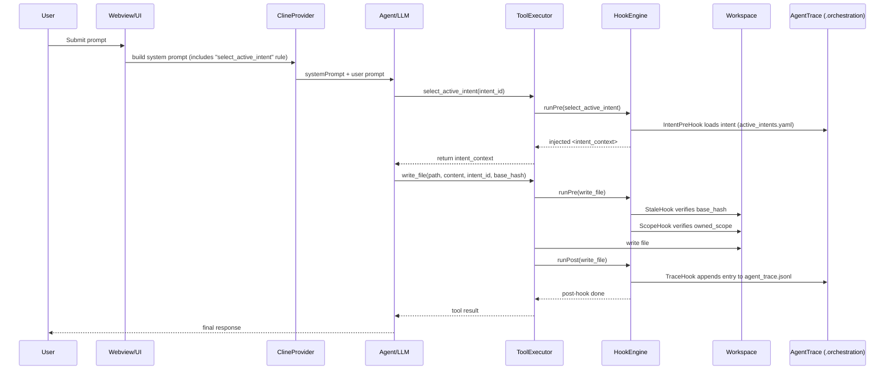

# TRP1 Roo Code Governed IDE Architecture

## Overview

This extension upgrades Roo Code into an Intent-Driven AI-Native IDE by injecting a deterministic Hook Middleware between the agent and tool execution.

## Core Innovation

Intent → AST → Trace linkage via sidecar orchestration database.

## Execution Flow

User → Agent → select_active_intent → Hook injects context → write_file → Hook logs trace.

## Hook Engine

Central interceptor wrapping all tools.

Pre-Hooks:

- Intent selection validation
- Scope enforcement
- Optimistic locking (StaleHook)
- .intentignore: intents listed there are excluded from writes

Post-Hooks:

- Content hashing
- Agent trace logging

## Sidecar Storage

.orchestration/

## Implementation Notes

- **Two execution paths**: (1) `select_active_intent` and script/test `write_file` go through `executeTool()` in `src/agent/toolExecutor.ts`. (2) Real UI `write_to_file` goes through `WriteToFileTool.handle()` in `src/core/tools/WriteToFileTool.ts`; hooks are invoked there (pre before write, post after save) with the same `HookEngine`.
- **Gatekeeper**: ScopeHook blocks `write_to_file` when no valid intent is selected; message: "You must cite a valid active Intent ID. Call select_active_intent(intent_id) first..."
- **Trace schema**: Each entry in `agent_trace.jsonl` includes `id`, `timestamp`, `vcs.revision_id` (git HEAD), `mutation_class` (AST_REFACTOR | INTENT_EVOLUTION), `files[].relative_path`, `conversations[].ranges[].content_hash` (sha256), `related[]` with type specification/intent.
- **intent_map.md**: Updated by TraceHook when appending a trace so the intent’s "Files:" section lists the modified file.

## Sidecar Files

- active_intents.yaml
- agent_trace.jsonl
- intent_map.md
- CLAUDE.md (shared brain)

## Semantic Git Layer

agent_trace.jsonl records:

- Intent ID
- Content hash
- File path
- Mutation range

## Parallel Safety

StaleHook prevents overwrite when file changed.

## Prompt Governance

System prompt enforces intent handshake.

## Result

Roo becomes a governed AI-native IDE with full intent traceability.

## Sequence Diagram (prompt → intent → tool → trace)

