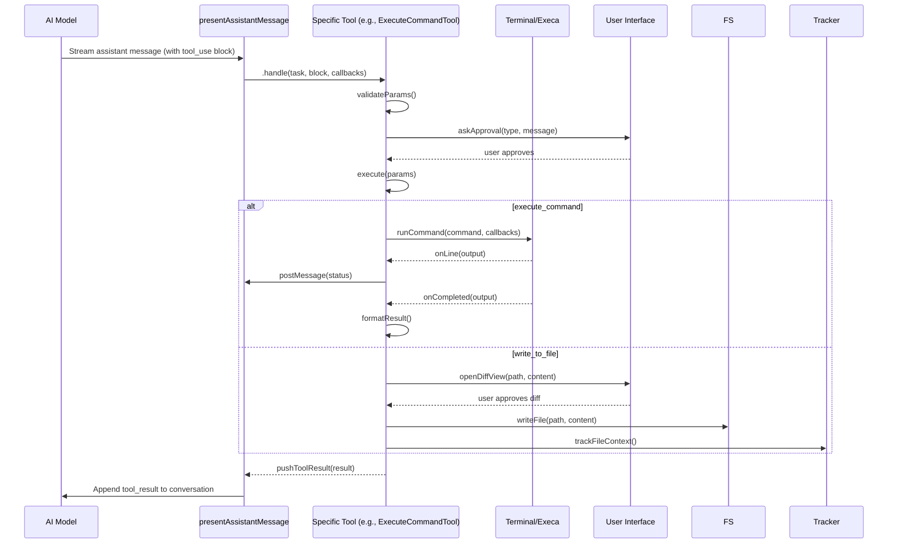

# Guide: Trace the Tool Loop

## Overview

The tool loop is the core execution flow that processes assistant messages and executes tool calls in the Roo Code extension. This document traces the exact path from when the AI model requests a tool (like `execute_command` or `write_to_file`) to when the action actually executes.

---

## High-Level Flow

```
AI Model Response (with tool_use blocks)
        ↓
presentAssistantMessage()
        ↓
[tool name dispatch switch]
        ↓
[Specific Tool Class].handle()
        ↓
[Specific Tool Class].execute()
        ↓
Actual Action (file write, command run, etc.)
```

---

## 1. Entry Point: `presentAssistantMessage`

**File:** `src/core/assistant-message/presentAssistantMessage.ts`

**Purpose:** This is the central message processor. It receives streamed content from the AI assistant and handles each block type (text, tool_use, mcp_tool_use).

### Key Code Snippet

```typescript
export async function presentAssistantMessage(cline: Task) {
	// ... locking and streaming logic ...

	switch (block.type) {
		case "tool_use": {
			// Native tool calling is the only supported tool calling mechanism.
			const toolCallId = block.id

			// Validation, repetition checks, etc.

			switch (block.name) {
				case "execute_command":
					await executeCommandTool.handle(cline, block as ToolUse<"execute_command">, {
						askApproval,
						handleError,
						pushToolResult,
					})
					break
				case "write_to_file":
					await checkpointSaveAndMark(cline)
					await writeToFileTool.handle(cline, block as ToolUse<"write_to_file">, {
						askApproval,
						handleError,
						pushToolResult,
					})
					break
				// ... other tools
			}
			break
		}
	}
}
```

**Note:** `presentAssistantMessage` is called iteratively as content streams from the API, processing each block sequentially.

---

## 2. Tool Dispatch

All built-in tools are imported at the top of `presentAssistantMessage.ts`:

```typescript
import { writeToFileTool } from "../tools/WriteToFileTool"
import { executeCommandTool } from "../tools/ExecuteCommandTool"
```

Inside the `switch (block.name)`, the function calls the tool's `.handle()` method with:

- `cline` (the Task)
- `block` (the ToolUse data structure)
- `callbacks` object containing `askApproval`, `handleError`, and `pushToolResult`

---

## 3. BaseTool Pattern

All tools extend `BaseTool<ToolName>` defined in `src/core/tools/BaseTool.ts`.

### BaseTool Structure

```typescript
export abstract class BaseTool<T extends ToolName> {
	abstract readonly name: T

	// Main entry point called by presentAssistantMessage
	async handle(task: Task, block: ToolUse<T>, callbacks: ToolCallbacks): Promise<void> {
		// Common pre-processing
		// Calls abstract execute()
		// Handles errors and cleanup
	}

	// Each tool implements its core logic here
	protected abstract execute(params: any, task: Task, callbacks: ToolCallbacks): Promise<void>

	// Optional: handle partial streaming updates
	override async handlePartial?(task: Task, block: ToolUse<T>): Promise<void> {}
}
```

---

## 4. Specific Tool Implementations

### 4.1 `execute_command`

**File:** `src/core/tools/ExecuteCommandTool.ts`

#### Execution Flow

1. **Validation**:

    - Ensure `command` param exists
    - Check `.rooignore` rules via `task.rooIgnoreController?.validateCommand()`
    - Increment mistake count on failure

2. **User Approval**:

    ```typescript
    const didApprove = await askApproval("command", canonicalCommand)
    if (!didApprove) return
    ```

3. **Terminal Execution**:

    - Calls `executeCommandInTerminal(task, options)`
    - Options include: `executionId`, `command`, `customCwd`, `terminalShellIntegrationDisabled`, `commandExecutionTimeout`

4. **Inside `executeCommandInTerminal`**:

    - Resolves working directory (relative to task cwd)
    - Checks directory exists via `fs.access(workingDir)`
    - Creates `OutputInterceptor` if global storage is available (for large outputs)
    - Obtains terminal from `TerminalRegistry.getOrCreateTerminal()`
    - Runs command: `terminal.runCommand(command, callbacks)`
    - Handles shell integration, timeouts, and fallback scenarios
    - Streams output via `onLine` callback
    - On completion, `onCompleted` finalizes interceptor and formats result

5. **Result Construction**:

    - If command still running: `runInBackground = true`, returns partial output
    - If completed: returns full output with exit status
    - If output truncated to disk: returns artifact ID and preview

6. **Push Result**:
    ```typescript
    pushToolResult(result) // sends to UI and API
    ```

---

### 4.2 `write_to_file`

**File:** `src/core/tools/WriteToFileTool.ts`

#### Execution Flow

1. **Validation**:

    - Ensure `path` and `content` exist
    - Check file write access via `task.rooIgnoreController?.validateAccess(relPath)`
    - Check if path is write-protected via `task.rooProtectedController?.isWriteProtected(relPath)`

2. **Determine Edit Type**:

    - Resolve absolute path: `absolutePath = path.resolve(task.cwd, relPath)`
    - Check if file exists: `await fileExistsAtPath(absolutePath)`
    - Sets `task.diffViewProvider.editType` to `"modify"` or `"create"`

3. **Prepare Content**:

    - Strip markdown code fences if present
    - Unescape HTML entities for non-Claude models
    - Resolve `isOutsideWorkspace` flag

4. **User Approval (Two Modes)**:

    **A. Prevent Focus Disruption Experiment (enabled)**:

    - Pre-reads original content (if modifying)
    - Generates unified diff via `formatResponse.createPrettyPatch()`
    - Single approval ask with diff content
    - On approval: `await task.diffViewProvider.saveDirectly(...)`

    **B. Standard Diff UI (default)**:

    - Partial UI update during streaming via `handlePartial`
    - Opens diff: `await task.diffViewProvider.open(relPath)`
    - Updates diff content: `await task.diffViewProvider.update(...)`
    - Final ask with unified diff
    - On approval: `await task.diffViewProvider.saveChanges(...)`
    - On rejection: `await task.diffViewProvider.revertChanges()`

5. **Post-Write**:
    - Track file context: `await task.fileContextTracker.trackFileContext(relPath, "roo_edited")`
    - Set `task.didEditFile = true`
    - Push tool result message: `await task.diffViewProvider.pushToolWriteResult(...)`
    - Reset diff provider and partial state

---

## 5. Callbacks

Callbacks are provided by `presentAssistantMessage` to each tool's `handle()` call.

### `askApproval`

**Signature:**

```typescript
;(type: ClineAsk, partialMessage?: string, progressStatus?: ToolProgressStatus, isProtected?: boolean) =>
	Promise<boolean>
```

- Prompts user for approval via the provider's UI.
- Records user response (`yesButtonClicked`, `messageResponse`, etc.)
- If denied, tools should `return` early.
- If approved with feedback, the feedback is merged into the tool result.

### `handleError`

**Signature:**

```typescript
;(action: string, error: Error) => Promise<void>
```

- Logs error to UI (`task.say("error", ...)`).
- Pushes an error tool result via `pushToolResult(formatResponse.toolError(...))`.
- Some errors (like `AskIgnoredError`) are silently ignored (control flow).

### `pushToolResult`

**Signature:**

```typescript
(content: ToolResponse) => void
```

- Constructs a `tool_result` block.
- Adds it to `cline.userMessageContent`.
- Ensures only ONE tool_result is sent per tool call (native tool calling requirement).
- Merges approval feedback if applicable.
- Sends result to the API provider.

---

## 6. The Host Extension's Tool Loop

In the VS Code extension, the **tool loop runs inside the chat provider** (`ClineProvider` in `src/core/webview/ClineProvider.ts`). The provider:

1. Receives messages from the user and the AI.
2. Streams assistant responses.
3. On each assistant message chunk, calls `presentAssistantMessage()`.
4. `presentAssistantMessage()` processes tool calls inline, awaiting their completion before moving to the next block.
5. The loop continues until the assistant signals completion (`attempt_completion`) or the task is aborted.

---

## 7. Error Handling & State Management

- **Consecutive Mistakes**: Tools increment `task.consecutiveMistakeCount` on validation failures; after a limit, the task may be paused/asked.
- **Checkpointing**: Before file edits (`write_to_file`, `apply_diff`, etc.), `checkpointSaveAndMark()` saves the task state to allow recovery.
- **Partial Streaming**: During streaming, `handlePartial` sends progressive UI updates; only on completion is approval requested.
- **User Rejection**: If a user rejects one tool, `cline.didRejectTool = true` causes subsequent tools in the same message to be skipped (with tool_result sent for each).

---

## 8. Key Files Reference

| Component                       | File                                                    |
| ------------------------------- | ------------------------------------------------------- |
| Main loop                       | `src/core/assistant-message/presentAssistantMessage.ts` |
| Base tool class                 | `src/core/tools/BaseTool.ts`                            |
| Execute command tool            | `src/core/tools/ExecuteCommandTool.ts`                  |
| Write to file tool              | `src/core/tools/WriteToFileTool.ts`                     |
| Tool definitions (native tools) | `src/core/prompts/tools/native-tools/`                  |
| Tool types & aliases            | `src/shared/tools.ts`                                   |
| Hook system (middleware)        | `src/agent/toolExecutor.ts`                             |
| Terminal integration            | `src/integrations/terminal/Terminal.ts`                 |
| Diff view provider              | `src/core/diff/DiffViewProvider.ts`                     |
| Task class                      | `src/core/task/Task.ts`                                 |

---

## 9. Diagram: Tool Loop Sequence



---

## 10. Summary

- The **tool loop** is driven by `presentAssistantMessage`, which processes each assistant content block.
- For `execute_command` and `write_to_file`, dispatch routes to their respective Tool classes.
- Each tool implements an `execute()` method containing the specific logic.
- Tools use callbacks (`askApproval`, `handleError`, `pushToolResult`) to interact with the task and UI.
- The loop respects user approvals, error handling, checkpointing, and streaming partial updates.
- All tool results are fed back to the API to continue the conversation.

This architecture provides a clean separation: the presenter manages flow, tools encapsulate behavior, and callbacks handle cross-cutting concerns (UI, errors, results).
